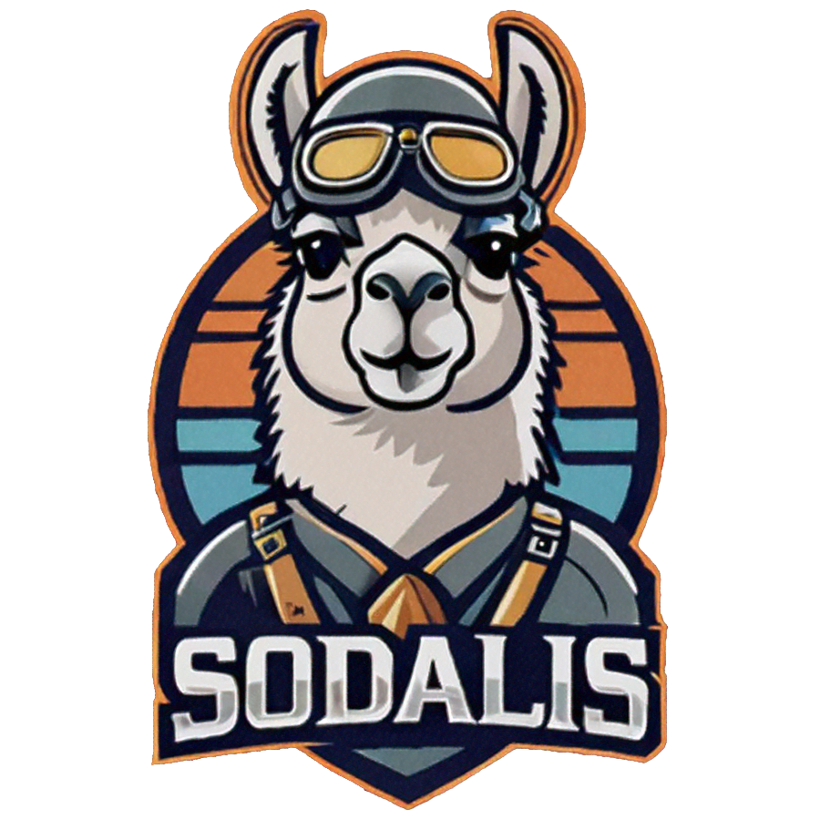

# Sodalis 



Sodalis enhances software development by offering cutting-edge AI-powered code completion and interactive chat capabilities. Utilizing local Large Language Models (LLMs) through Ollama, Sodalis provides developers with real-time coding assistance, enabling efficient and productive workflows.

<br style="clear:right; margin-bottom: 2em;" />

**Key Features:**
- **AI-Powered Code Completion:** Automates and accelerates the coding process by providing context-aware suggestions as you type.
- **Interactive Chat Interface:** Engage in meaningful conversations about your code, allowing for dynamic debugging and problem-solving.
- **Local LLMs with Ollama:** Run AI models directly on your machine for faster response times, enhanced privacy, and customizable workflows.
- **Seamless Integration:** Compatible with popular IDEs, Sodalis fits effortlessly into your existing development environment.
- **Efficiency Boost:** Reduce repetitive tasks and focus on innovative coding with intelligent suggestions tailored to your project's context.

**Benefits:**
- **Faster Development:** Streamline your workflow with instant code suggestions and interactive chat features.
- **Enhanced Privacy:** By using local models, Sodalis ensures that your code remains secure and free from external data collection.
- **Customizable Solutions:** Tailor your AI experience to match your specific needs and preferences.

**Use Cases:**
- **Code Completion:** Automatically complete lines of code while writing software, saving time and reducing errors.
- **Interactive Debugging:** Use the chat interface to troubleshoot issues and explore different solutions dynamically.
- **Collaborative Development:** Facilitate teamwork by sharing insights and discussing code in real-time.

---
## **Getting Started:**
Elevate your coding experience with Sodalis. Whether you're a seasoned developer or just starting out, Sodalis offers tools that enhance productivity and creativity. 

Sodalis is not yet published through the Marketplace as its in active development but if you would like to install it you can pull code down and package it up, then install the vsix. 

### Step-by-Step Instructions
1. **Use Git to clone the repository to your local machine.**
 ```sh
 git clone git@github.com:shaynemeyer/sodalis-local.git
 ```
2. **Install Dependencies** - Navigate to the root directory of the cloned repository and install all required dependencies using npm.
```sh
cd sodalis-local
npm i
``` 
3. **Install VSCode Extension Packager Library** 
```sh
npm i -g @vscode/vsce
```
This installs the vsce command-line tool, which is used to package VS Code extensions.

4. **Package the Extension**
- Use the VSCode Extension Packager to create a .vsix file.
 ```sh 
 vsce package
 ```
 - This will generate a .vsix file in your project directory, which contains all necessary files for the extension.
5. **Install the Generated `.vsix` File**
- `cmd + shift + p` (Mac) or `ctrl + shift + p` (Windows).
- Select "Install from VSIX" from the menu options.
- Navigate to your project directory and select the `.vsix` file.


---
## Commands
With the extension installed there are several commands you can run.

On a Mac: `CMD + Shift + P` to open the VSCode Command Pallet. There you should find these commands:

- `Select Default Model` - Sets the default model for Ollama to use.
- `Search Available Models` - Search the models available with Ollama.
- `Clear Completion Cache` - Clears the code completion cache.
- `Update Ollama Host` - Update the Ollama API Host address.
- `Open Sodalis Chat Panel` - Opens the Sodalis Chat Panel.

---
## Requirements

You must have Ollama installed on your machine with at least 1 model downloaded.

For more on [Ollama](https://ollama.com/).

---
## Commands

